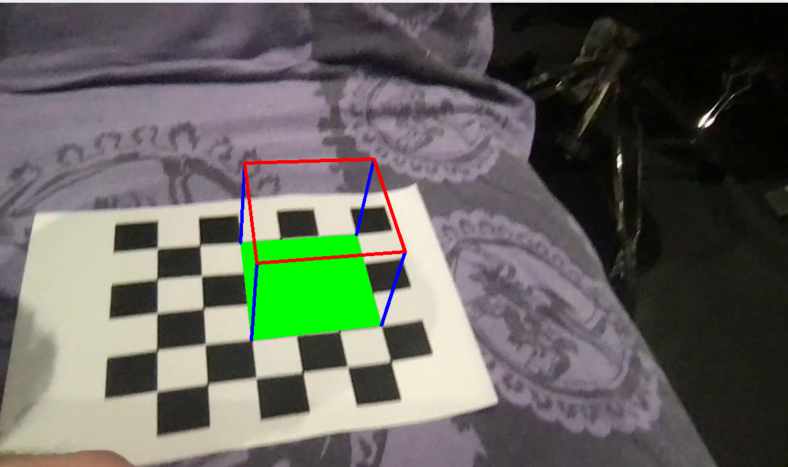

# Computer Vision and Pattern Recognition Practical at ENSIMAG 3A MMIS 

**NOTE** I have ported most of my school projects (rather hastely) because my gitlab subscription was going to expire and with it evry bit of (some would say poorly written) code I have written. But for nostalgia's sake why not ! (I also find myself more than I want to coming back to bits and pieces of code I used).

This was a practical done for the CVPR course, the aim of the practical was achieved by having such a vizualisation (a modified version of the one given in the OpenCV tutorial for video frames) as below.

An attempt has been made to use SIFT (always through OpenCV) as a substitue for the chessboard detection tool used in the previous part. This attempt (that runs very poorly with the test images provided, but in principle should work) is inside the *Test.py* file (the *demoAR.py* is the one with the base function).
